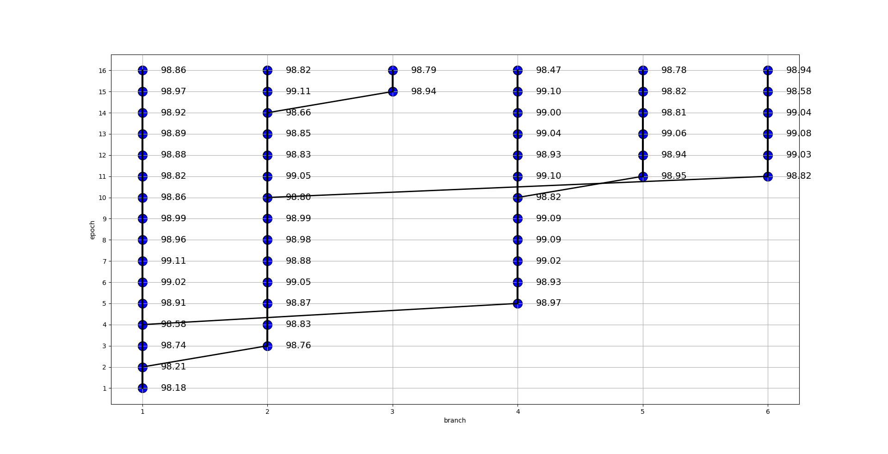

# Torch-Checkpointer

## Multi branch model training

Systematically branches out torch models through re-training epochs with changed random seed where the absolute performance delta in successive epochs is the highest. The <code>TorchCheckpointer</code> implements a binary tree in the <code>CheckpointTree</code> module. Each node in the tree points to a saved model carrying information about epoch, difference to previous epoch and model test accuracy. The tree is parametrized through a <code>tree_height</code> which dictates the number of trained epochs and <code>tree_branches</code> that determines how many branchings we perform.
During runtime both the model weights and optimizer state are saved with the base10 encoding of the binary position of the node, where going left in a node is represented as (1) and going to the right node is represented with a (0). For example, the binary node position (read from left to right) 1100$1_{2}$ $= 25_{10}$ corresponds to root(1)->left(1)->right(0)->right(0)->left(1). 

---

2D representation of the <code>TorchCheckpointer</code> where the main branch (branch = 1) creates alternative models through random seed perturbation. The branches are displayed in chronological order where the next branch is chosen as the node where the absolute difference to its subsequent node is the highest in the current tree. 

3D representation of the same tree with the z-value corresponding to model accuracy. 

